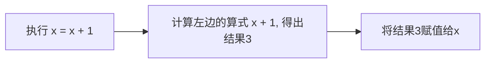

# Compute
（注： 本章可以适当跳读, 像《西游记》:）  
计算机，顾名思义就是可以做数学计算的机器， 所以python也很自然的添加了计算功能，例如加法，减法等等

## int的计算
```python
print（114514 + 1919810)
```

复制代码并观察输出结果，你看到的结果应为：2034324。上述代码展示了两个``int``之间的加法。除此之外，有关整数的运算还有``+ - * / ``都可望文生义，不多介绍。这里特别说明3个：
```python
x: int = 2
y：int = 3
print(x ** y)
print(x // y)
print(x % y)
```
> 结果：  
    8  
    0  
    2  

+ ``**`` 是乘方，而 $ 2^3 = 8 $ 所以第一行结果为8。  
+ ``//`` 是整除，$ 2 \div 3 = 0 \cdots 2$, 所以第二行结果为 0
+ ``%`` 是余数， $ 2 \div 3 = 0 \cdots 2$， 所以第三行结果为 2

## float的计算
与int类似， 但是没有 ``//``和 ``%``

## 比较运算符
比如说 > ，运算符，比如+, -这种总有返回值，比较运算符也一样。
```python
print(3 > 2)
```
输出结果是：
> True  

倘若你认真阅读，你应该可以发现比较运算符返回的是布尔值。

比较运算符主要有：  
+ \>  大于号
+  <  小于号
+ \>= 大于等于号
+ <= 小于等于号
+ == 等于号
+ != 不等于

## 赋值运算符
这里我们等重新理解一下赋值运算符，先看看如下代码。
```python
x: int = 2
x = x + 1
print(x)
```
输出结果是： 3。我们来深入理解一下赋值运算符。

赋值运算就是用于抽象x = x + 1这一类代码的运算符，比如
```python
x: int = 2
x += 1
print(x)
```
两段代码意思相同，想必大家也能猜出``+=``的用法了。类似的赋值运算符还有
+ ``-=``
+ ``/=``
+ ``*=``
+ ``%=``
+ ``**=``
+ ``//=``


  