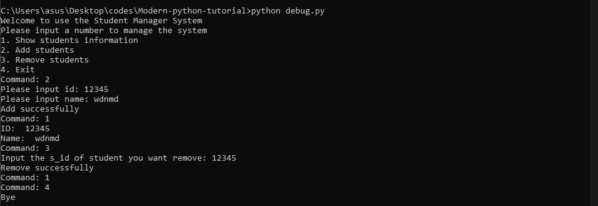

# Practise Project 
## 学生管理系统
对于学编程来说，多多训练时很重要的，所以我们通过写一个学生管理系统来锻炼锻炼。因为我们还没有学习桌面应用的开发，目前系统只能通过键盘来运行。

1. 设计要求
需要有一个开始界面来展示常用功能。举个例子：
> Welcome to use the Student Manager System
Please input a number to manage the system
>`1.` Show students information
>`2.` Add students
>`3.` Remove students
>`4.` Exit
功能已经再开始菜单被介绍了，剩下的内容自己设计去吧。：）

还是举个例子吧，给一张成品的示意图。


其中，我们需要保存student的名字和id。

2. 架构设计
代码可大致写成
```python
# print menu
print("Welcome to use the Student Manager System")
print("Please input a number to manage the system")
print("1. Show students information")
print("2. Add students")
print("3. Remove students")
print("4. Exit")
data: dict = {

}

while True: 
    command:str = input("Command: ")
    if command == "1":
        ...
    elif command == "2":
        ...
    elif command == "3":
        ...
    elif command == "4":
        ...

```